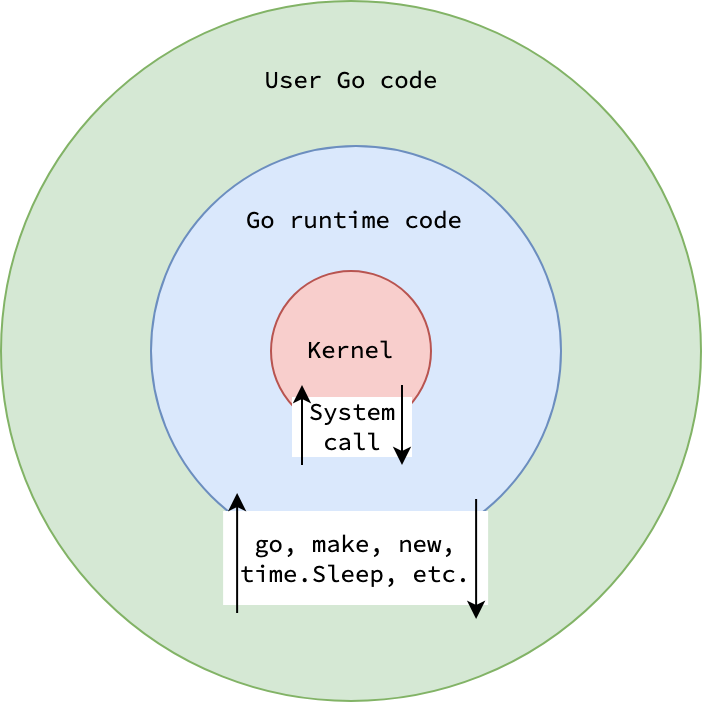
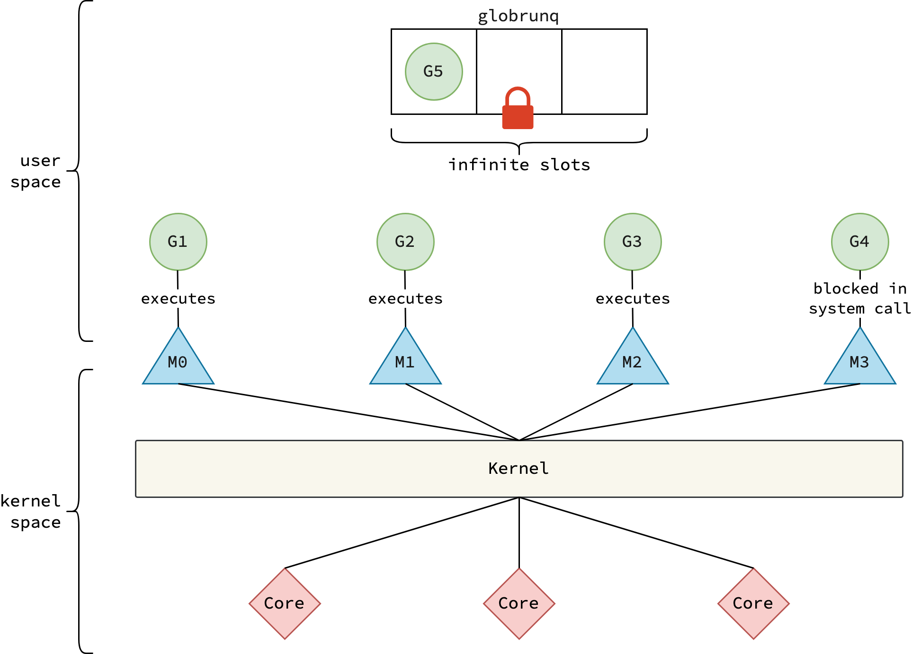
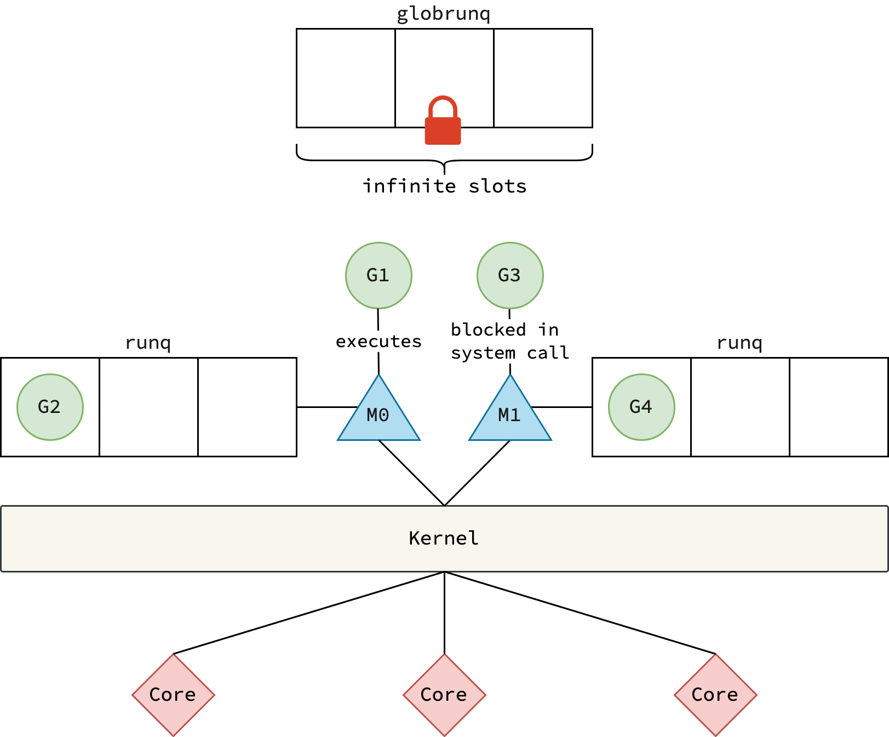
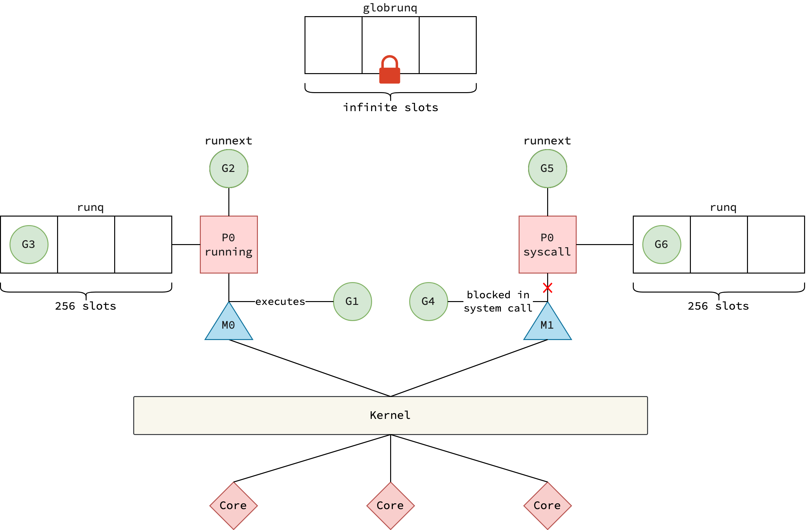

# Go Runtime Scheduler

### Resource Used: 
- [nghiant3223's blog post](https://nghiant3223.github.io/2025/04/15/go-scheduler.html)
- [Dmitry Vyukov's Doc](https://docs.google.com/document/d/1TTj4T2JO42uD5ID9e89oa0sLKhJYD0Y_kqxDv3I3XMw/edit?tab=t.0#heading=h.mmq8lm48qfcw)

## Compilation and Go Runtime

Three steps of the Go compilation process:
1. Compilation: Go source file (`*.go`) are converted to Assembly files (`*.s`)
2. Assembling: The assembly files (`*.s`) are assembled into object files (`*.o`)
3. Linking: The object files are linked together to make the final single executable binary file.

To understand Go's Runtime Scheduler, one first must understand what is the Go Runtime. Go runtime is nothing but a collection
functions and data structures that makes the Go programs work. 

The code for the Go Runtime package can be found under [here](/usr/lib/go/src/runtime). Its written in Go and Assembly.
Where assembly is used mainly for dealing with low-level operations like registers.

After the compilation step, Go compiler replaces 2 keywords:
1. `go` -> `runtime.newproc`
2. `new` -> `runtime.newobject`

Some functions of the Go runtime have no Go implementation at all. Some implementations are written entirely in assembly, 
whereas some are linked by the compiler using a `//go:linkname` directive.

Eg. `time.Sleep` is linked to `runtime.timeSleep`

## Primitive Scheduler
> Go scheduler isn't one giant standalone file, but rather a bunch of functions which help in scheduling.
> Also the scheduling functions don't run on a separate thread, but they run on the same threads as the goroutines do (as mentioned in the README.md)

Multithreading models are being used to facilitate concurrency. These models define how the user-space threads (Goroutines in Go, coroutines in Kotlin) are
going to be multiplexed onto the kernel-space threads.

The 3 kinds of Multithreading models are:
1. Many-to-one
2. One-to-one
3. Many-to-many

Golang uses the 3rd option (Many to Many) threading model. This model is complex to implement but takes full advantage of the multicore system that 
the process will run on. This makes Go efficient with system calls and also fixes problems faced by programming languages opting for Many-to-one or One-to-one models.

The kernel has no idea what a goroutine is, it only offers kernel threads which can be used to run the Go's scheduling logic, make system calls on behalf of goroutines and much more.
 
Before Go v1.1, the Many-to-many model was implemented in a very naive way.

### Naive Implementation of Many to Many model

There were 2 entities:
- (G) Goroutines
- (M) Machines (aka kernel threads)

A **single global run queue** used to store all the **runnable goroutines** and it was guarded with a lock to prevent race conditions.

The scheduler which runs on every thread(M) was responsible for selecting a goroutine from the global run queue and executing it as described in the below image.

> Dmitry Vyukov pointed out multiple issues with this implementation, as pointed out in his [famous doc](https://docs.google.com/document/d/1TTj4T2JO42uD5ID9e89oa0sLKhJYD0Y_kqxDv3I3XMw/edit?tab=t.0#heading=h.mmq8lm48qfcw)

### What Dmitry Vyukov Pointed Out?
1. **The global run queue was a performance bottleneck**: When a goroutine was created, the threads had to acquire a lock to put it in the global queue. Similarly when querying the queue for a goroutine to execute, the thread again had to acquire a lock. The locks were user-space (application controlled). This caused **Lock Contention** (Multiple threads (M) try to acquire the same lock of the global run queue simultaneously)

2. **Threads frequently juggled goroutine between each other**: This causes performance issues since the parent and child goroutines will be separted on to different threads, which will cause performance issues. It also caused a lot of kernel-space context switches.

3. **Wasted thread-local cache memory for blocked threads**: Every thread `M` has a thread-local cache so that it can use it for allocation or to hold free memory.
The problem is that mcache is only use by threads which actually execute Go code, and the ratio of threads executing go code to the ones which don't (because of being blocked by system calls or any other reason) can go upo 1:100. Each mcache thread can take upto 2MB per thread, it can result into hundreds of MB of memory being wasted.
And this memory is not freed until the thread is destroyed.

#### Why Parent and Child Goroutines Executing on Different Kernel Threads Isn't Optimal?

The simple answer to this question is: **CPU Cache Locality**. Its a technique where a process takes advantage of the CPU caches,
which reside much closer to the core, by using data which was just recently accessed, leading to the data being found in CPU caches
rather than the slow main memory.

A **parent goroutine** refers to the goroutine from which the child goroutine is spawned, either using the `go` keyword or the `runtime.newproc` method.

### CPU Components Relevant to Execution:
1. **Registers**: The smallest and fastest storage inside a CPU core used for immediate calculations. Registers are closest to the CPU core and incur minimal delay.
2. **L1 Cache**: The first-level cache, smallest and fastest, located inside the CPU core.
3. **L2 Cache**: The second-level cache, larger but slower than L1, and also located within the CPU core.
4. **L3 Cache**: The third-level cache, larger and slower than L2, shared among all CPU cores (not core-local).

### What Is a Context Switch?

Context switching is a technique performed by CPU cores to give the illusion of parallelism by switching the CPU's execution from one process(thread) to another.

#### Causes for a CPU Core Context Switch:
1. Hardware interrupts.
2. Directives from the OS scheduler.
3. Execution of system calls by the kernel.
4. Arrival of a higher-priority process or thread.

A CPU core can only execute instructions from one thread at a time. While a single-threaded process uses only one thread, multi-threaded processes leverage multiple CPU cores.

#### What Happens During Context Switching?

- The CPU saves the execution state (context) of the currently running thread/process (Process A) and restores the context of the next thread/process (Process B).
- This swapping includes registers such as:
  - General purpose registers
  - Address registers
  - Instruction register (program counter)
  - Process flags
  - Memory limits
  - Stack pointer
  - And more...
- This state is saved in a **PCB (Process Control Block)** so that when a process resumes, it continues exactly where it left off.
- The PCB is stored in **main memory (RAM)**.

### What Happens During a Kernel-Level Context Switch?

- The CPU registers are overwritten by the kernel with the register values of the incoming process/thread from its PCB.
- Before replacing, the kernel checks whether these values differ from the current ones to avoid unnecessary writes.
- If a value isn't found in the register or cache, the CPU looks for it in the **three levels of cache (L1, L2, L3)** in order.
- If the value isn't in any cache (cache miss), it's fetched from **main memory**.
- The fetched value is then placed back into **L3 cache**, then **L2 cache**, then **L1 cache**, anticipating that it will be quickly used again.

### Why Is Cache Locality Important for Parent and Child Goroutines?

Parent and child goroutines often access similar data from the heap memory or share references due to their logical relationship or communication needs.

Running both goroutines on the **same kernel thread (and thus likely the same CPU core)** means their data is more likely to reside in the local caches (L1 or L2) of that core.

This reduces the latency of memory access, improving overall performance.

#### Why Juggling Goroutines to Other Threads Causes User-Space Context Switches?

The primary scheduler's job is to decide that which goroutine will be executed by the native OS thread. Which 
requires the scheduler to store information about each goroutine like its registers, CPU state, stack pointer and program counter(much smaller
to what the kernel stores in a kernel-space context switch). After storing this information it then loads the next Goroutine for the native OS thread to execute.

(incomplete)

## Scheduler Enhancement

### 1. Introduction of a Local Run Queue
Each thread (M) now has their own local run queue with Goroutines (G) inside it. When a Goroutine(G) spawns another Goroutine(G1) on thread (M), (G1) is 
put in the local run queue of (M), if the  local run queue of (M) is full, then it will be placed in the global run queue. When a thread (M) is ready to execute
goroutines it will first check its local run queue for goroutines, if its empty then it will look inside the global run queue.

This proposal solves the problems, but introduces performance overheads. When multiple threads are blocked because of system calls,
the goroutines for each thread in the local run queue are stalled/blocked too. To solve this issue, the scheduler should allow,
other non-blocked threads to steal the goroutines from other threads' local run queue. This solution is possible but not feasible,
since its computationally expensive to scan the local run queues of all the blocked threads to find Goroutines.

### 2. Introduction of Logical Processors (P)

P is a `logical` processor it means that it only pretends to execute Go code but in reality only a `M` can execute a Goroutine when its attached to a `P`.
The thread's local run queue and the mcache are now owned by `P`'s rather than `M`'s.

This solves the 3rd problem in the list mentioned above. Since `mcache` is now `P`-local, when `G` faces a blocking system call, `M` is detached from `P`, now the memory consumption stays low when a large number of `M`'s executing `G`'s are blocked, which wasn't the case earlier. The **stealing mechanism** is also efficient when `P` is limited.

